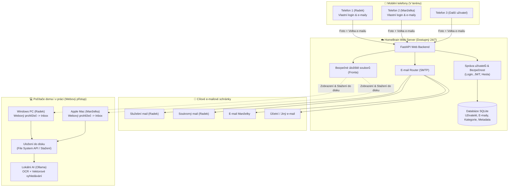

# 🧠 HomeBrain — Projektová dokumentace a specifikace

> **Inteligentní rodinný multi-user správce dokumentů, účtenek a smluv s e-mailovým směrováním, webovým inboxem pro PC/Mac a budoucím lokálním AI asistentem.**

---

## 1. Vize a účel projektu

### Problém
V rodině vzniká neustálý tok tištěných i digitálních dokumentů:
* **Paragony a účtenky** (služební výdaje, parkování, nákupy do domácnosti).
* **Lékařské zprávy** (kontroly, recepty, lékařské posudky).
* **Smlouvy a úřední dokumenty** (pojistky, energie, bankovní výpisy).

Každý člen rodiny (např. manžel, manželka) má jiné potřeby:
* Manžel potřebuje posílat pracovní účtenky do svého služebního e-mailu a lékařské zprávy do soukromého.
* Manželka potřebuje posílat dokumenty do svého vlastního e-mailu.
* Manžel používá Windows PC (často střídá počítače), manželka má Mac – systém proto **nesmí být vázán na konkrétní operační systém ani vyžadovat instalaci desktopových aplikací**.

### Řešení: HomeBrain (Čistě webové multi-user řešení)
1. **Mobilní rozhraní na cestách (PWA v prohlížeči)**:
   * Každý člen rodiny má vlastní přihlášení, které si telefon trvale pamatuje.
   * Na dvě kliknutí: **Vyfotit -> Vybrat záložku (např. Paragon) -> Zvolit cílový e-mail -> Odeslat**.
   * E-mail se ihned odešle s přednastaveným předmětem a přílohou.
   * Soubor se zařadí do webového inboxu daného uživatele (*„Čeká na uložení do PC/Macu“*).
2. **Webový Inbox na PC a Macu**:
   * Otevře se v jakémkoliv prohlížeči (Chrome, Safari, Edge) na libovolném počítači.
   * Uživatel vidí přehled nových dokumentů k uložení.
   * Možnost jedním kliknutím zapsat soubory do zvolené složky na disku (využití moderního *File System Access API* prohlížeče) nebo stáhnout jako ZIP / jednotlivé soubory.
3. **Lokální AI (Ollama) pro vytěžování dat (Fáze 3)**:
   * Lokální AI na PC/Macu projde uložené soubory, provede OCR a umožní klást dotazy přirozeným jazykem (např. *„Kdy jde Radek na kontrolu?“*).

---

## 2. Architektura systému

---

## 3. Klíčové moduly a funkcionality

### 1. Správa uživatelů a zabezpečení
* **Multi-user od základu**: Každý uživatel má vlastní účet (jméno, přihlašovací heslo/PIN).
* **Role**: Správce (může přidávat další uživatele) a běžný uživatel.
* **Trvalé přihlášení**: Na osobním telefonu a počítači se uživatel přihlásí jednou (bezpečný token v `localStorage`), takže aplikace neobtěžuje opakovaným přihlašováním.
* **Ochrana před cizími lidmi**: Veškeré API a webové rozhraní jsou chráněny autorizací.

### 2. Uživatelské nastavení a profily
* **Cílové e-maily**: Každý uživatel si může definovat libovolný počet cílových e-mailů (např. *Služební*, *Soukromý*, *Účetní*).
* **Záložky / Kategorie**:
  * Název kategorie (např. *Paragon*, *Lékařská zpráva*, *Smlouva*, *Auto / Servis*).
  * Výchozí cílový e-mail pro danou kategorii.
  * Šablona předmětu e-mailu: `[Název položky] - {datum} - {poznamka}`.
  * Možnost **kdykoliv přidat novou záložku/kategorii** přímo z webu.

### 3. Mobilní rychlý sběr (Focení na 2 kliknutí)
1. Otevření webové adresy v mobilu.
2. Tlačítko **Vyfotit** (přímé spuštění fotoaparátu) nebo výběr existujícího souboru.
3. Výběr záložky (např. *Lékařská zpráva*).
4. Volba cílového e-mailu (předvyplněn výchozí pro danou záložku).
5. Volitelná poznámka (např. *„Parkovné nemocnice“*).
6. Tlačítko **Odeslat**:
   * E-mail ihned odejde s přílohou a přesným předmětem.
   * Záznam a soubor se zařadí do schránky k uložení na PC/Mac.

### 4. Webový Inbox pro PC & Mac (Ukládání na disk)
* Žádný instalovaný software do operačního systému.
* Uživatel otevře web na Windows PC nebo Macu a vidí **„Co na mě čeká“** (Inbox):
  * Seznam nahraných dokumentů s náhledy miniatur, datem a kategorií.
* **Ukládání na lokální disk**:
  * **File System Access API (Chrome/Edge)**: Umožňuje v prohlížeči vybrat kořenovou složku na PC/Macu a jedním kliknutím na *„Uložit připravené“* soubory automaticky uložit do podsložek na disku.
  * **Klasické stažení / ZIP**: Možnost stáhnout vybrané soubory nebo celý balík ve formátu ZIP rozdělený do podsložek.
* Po uložení se položky ve webu označí jako zpracované/archivované.

---

## 4. Technologický stack

| Vrstva | Technologie | Popis |
| :--- | :--- | :--- |
| **Backend** | **Python 3.11+ / FastAPI** | Výkonný, moderní asynchronní framework, ideální pro správu souborů, e-mailů a budoucí napojení AI. |
| **Databáze** | **SQLite (přes SQLAlchemy/SQLModel)** | Jednoduchá, bezúdržbová databáze pro uživatele, e-mailové profily, kategorie a historii dokumentů. |
| **Frontend** | **Responzivní Web (HTML5, Tailwind CSS, Modern JS)** | 100% multiplatformní, přizpůsobené pro telefony (PWA) i velké obrazovky PC/Macu. |
| **E-mail** | **Standardní SMTP protokol** | Podpora Seznam.cz, Gmail (aplikační heslo), firemního SMTP nebo cloudových služeb (Resend, Brevo). |
| **Hosting** | **Docker kontejner** | Připraveno pro nasazení na jakýkoliv cloud (Render, Railway, Fly.io) nebo domácí mini-server. |
| **Budoucí AI** | **Ollama (Lokální běh)** | Běží na PC/Macu uživatele při zapnutí – lokální OCR + RAG Q&A bez odesílání citlivých rodinných dat do cloudu. |

---

## 5. Roadmapa realizace

- [x] **Specifikace a architektura**: Ucelený návrh multi-user webového řešení pro PC i Mac.
- [ ] **Fáze 1 (Aktivní cíl)**:
  - Backend (FastAPI, SQLite, správa uživatelů a rolí, správa e-mailů a kategorií, SMTP odesílání).
  - Mobilní frontend (Focení, rychlé odeslání s volbou e-mailu a předmětu, správa záložek).
  - Webový Inbox pro PC/Mac (přehled čekajících dokumentů, stažení / uložení na disk).
  - Možnost přidávat další uživatele (admin rozhraní).
- [ ] **Fáze 2 (Pokročilé uložení a automatizace)**:
  - Pokročilé mapování podsložek a automatické ukládání do disku přes browser File System API.
- [ ] **Fáze 3 (Lokální AI - Ollama & NotebookLM styl)**:
  - OCR skenování textu z vyfocených zpráv a paragonů.
  - Vektorové vyhledávání a asistent odpovídající na rodinné dotazy (*„Kdy jde Radek na kontrolu?“*).
