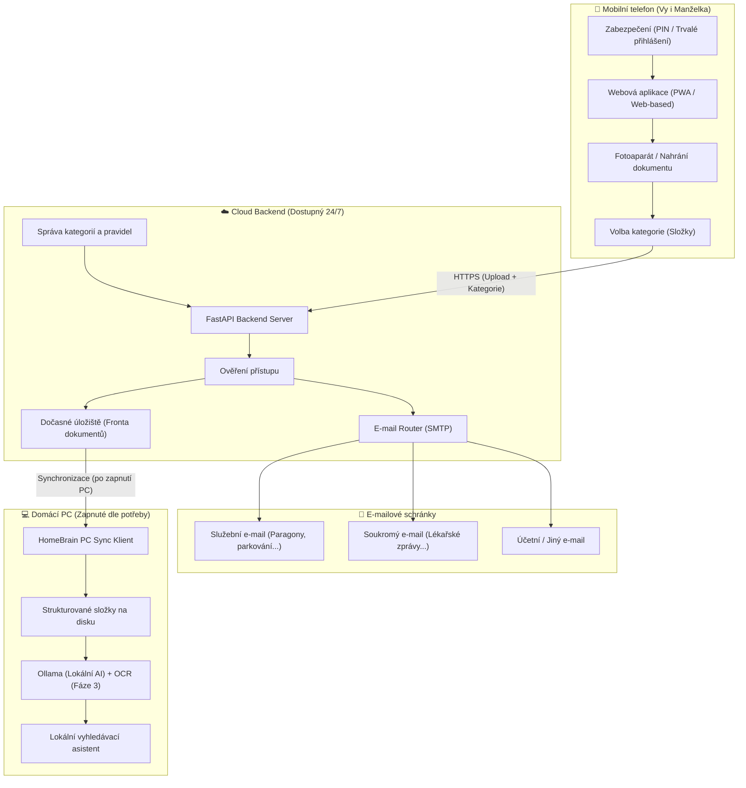

# 🧠 HomeBrain — Projektová dokumentace a specifikace

> **Inteligentní rodinný správce dokumentů, účtenek a smluv s e-mailovým směrováním, lokální synchronizací a budoucím AI asistentem.**

---

## 1. Vize a účel projektu

### Problém
V každodenním životě rodiny vzniká spousta papírových a digitálních dokumentů:
* Účtenky a paragony (služební výdaje, parkování, záruční listy).
* Lékařské zprávy (recepty, termíny dalších kontrol, posudky dětí).
* Smlouvy, pojistky, úřední dopisy.

Tyto dokumenty se často ztratí, vyblednou, nebo zůstanou zapomenuté v galerii mobilu. Když je člověk potřebuje najít (nebo odeslat účetnímu/do práce), stojí to spoustu času.

### Řešení: HomeBrain
Jednoduchá webová aplikace (optimalizovaná pro mobilní telefony), kde stačí:
1. **Otevřít odkaz na mobilu** (zabezpečený jednoduchým PINem / heslem, aby se k němu nedostal nikdo cizí).
2. **Kliknout na „Vyfotit“** (automaticky otevře fotoaparát).
3. **Zvolit kategorii / složku** (např. *Paragon*, *Lékařská zpráva*, *Smlouva*).
4. **Odeslat jedním kliknutím**:
   * Okamžitě odejde e-mailem na správnou adresu (např. firemní e-mail pro účtenky, soukromý pro lékaře) s přesně nastaveným předmětem.
   * Zároveň se uloží do cloudové fronty, odkud se po zapnutí domácího PC automaticky stáhne do přehledné struktury složek.
   * V budoucnu data na PC zpracuje lokální AI (Ollama) pro chytré vyhledávání přirozeným jazykem.

---

## 2. Architektura systému

Systém se skládá ze tří hlavních komponent:



---

## 3. Rozpad projektu do fází (Roadmapa)

### 🎯 Fáze 1: Mobilní webový sběr & E-mail Router (AKTUÁLNÍ CÍL)
* **Zabezpečení**:
  * Ochrana webu přístupovým kódem / PINem s „Zapamatovat na tomto zařízení“ (session token).
  * Manželka ani vy nemusíte při každém focení zadávat heslo znovu.
  * Cizí člověk z internetu se k nahrávání ani datům nedostane.
* **Mobilní Web UI (Web-based PWA)**:
  * Velká přehledná tlačítka: *Vyfotit*, *Vybrat ze souborů*.
  * Volba kdo nahrává (např. *Radek* / *Manželka*).
  * Přepínač kategorií (rychlá volba: *Paragon*, *Lékařská zpráva*, *Smlouva*, *Auto / Parkování*...).
  * Tlačítko **Přidat novou složku / kategorii** přímo z rozhraní.
* **E-mailové odesílání (SMTP Router)**:
  * Každá složka má definovaný:
    * Cílový e-mail (např. `firma@prace.cz`, `osobni@seznam.cz`).
    * Šablonu předmětu (např. `[Paragon] 2026-09-19 - Nákup`).
    * Volitelně rychlou poznámku k dokumentu.
* **Cloudové uložení do fronty**:
  * Soubory se bezpečně uloží do databáze/úložiště a čekají na stažení do PC.

---

### 📂 Fáze 2: PC Synchronizace & Lokální struktura
* Jednoduchý skript / aplikace běžící na domácím PC s Windows.
* Jakmile se PC zapne nebo na pokyn v aplikaci („Uložit připravené“):
  * Stáhne nové dokumenty z cloudu.
  * Uloží je na PC do logického stromu složek:
    ```text
    C:\HomeBrain_Data\
    ├── Paragony\
    │   └── 2026\
    │       ├── 2026-09-19_paragon_parking.jpg
    │       └── 2026-09-19_paragon_parking.meta.json
    ├── Lekarske_zpravy\
    │   └── 2026\
    └── Smlouvy\
    ```
  * Potvrdí cloudu úspěšné stažení (cloudová fronta se může pročistit).

---

### 🧠 Fáze 3: Lokální AI & Domácí „NotebookLM“ (Ollama)
* **Běží výhradně lokálně na vašem PC**:
  * Bezpečnost: Lékařské a rodinné dokumenty neopouštějí váš počítač do cizích cloudových AI.
  * Běží pouze tehdy, když je PC zapnuté.
* **OCR & Vytěžování dat**:
  * Automatické rozpoznání textu z fotografií a PDF (např. Tesseract / OCR / Vision modely).
  * Extrakce klíčových dat: datum vystavení, datum příští návštěvy, jména lékařů, částky.
* **Vektorové vyhledávání (RAG) a chatovací asistent**:
  * Možnost klást dotazy přirozeným jazykem:
    * *Dotaz*: „Kdy jde Radek na kontrolu?“
    * *Odpověď*: „Podle zprávy od MUDr. Nováka z 12. 5. je kontrola 15. 10. v 9:00 v ordinaci na Poliklinice.“

---

### 👥 Fáze 4: Multi-tenancy, GDPR a veřejné nasazení
* Plnohodnotná registrace nových rodin/uživatelů.
* Striktní oddělení dat jednotlivých uživatelů.
* GDPR souhlasy, šifrování databází atd.

---

## 4. Technologický stack (Fáze 1 & 2)

| Komponenta | Technologie | Důvod volby |
| :--- | :--- | :--- |
| **Backend API** | **Python (FastAPI)** | Moderní, rychlý, nativně asynchronní, perfektní ekosystém pro pozdější napojení Ollama / AI. |
| **Frontend** | **Mobilní Web (HTML5 / Tailwind CSS / Vanilla JS)** | Bleskové načítání na mobilu, funguje spolehlivě v Safari i Chrome bez nutnosti instalace aplikací. |
| **Zabezpečení** | **PIN / Session Token** | Jednoduché pro rodinu (neotravuje složitým přihlašováním při každém nákupu), ale bezpečné proti cizím. |
| **Odesílání e-mailů** | **SMTP (Gmail / Seznam / Sendgrid / Resend)** | Standardizovaný e-mailový protokol, nulové náklady. |
| **Cloud Hosting** | **Docker / Render / Fly.io / VPS** | Možnost provozu zdarma na Free Tier nebo na malém virtuálu. |
| **PC Klient** | **Python skript / Windows executable** | Nenáročné na zdroje, běží na pozadí Windows. |

---

## 5. Pravidla pro složky a směrování (Příklad konfigurace)

Aplikace bude mít jednoduchou správu kategorií:
```json
[
  {
    "id": "paragon-sluzebni",
    "nazev": "Paragon (Služební)",
    "cilovy_email": "prace@firma.cz",
    "predmet_sablona": "Paragon - {datum} - {poznamka}",
    "cilova_slozka_pc": "Paragony/Sluzebni"
  },
  {
    "id": "lekarska-zprava",
    "nazev": "Lékařská zpráva",
    "cilovy_email": "radek.osobni@seznam.cz",
    "predmet_sablona": "Lékařská zpráva - {datum} - {poznamka}",
    "cilova_slozka_pc": "Lekarske_zpravy"
  },
  {
    "id": "smlouva",
    "nazev": "Smlouva",
    "cilovy_email": "radek.osobni@seznam.cz",
    "predmet_sablona": "Smlouva - {datum} - {poznamka}",
    "cilova_slozka_pc": "Smlouvy"
  }
]
```
Uživatel si může v rozhraní kdykoliv přidat novou složku podle potřeby.
